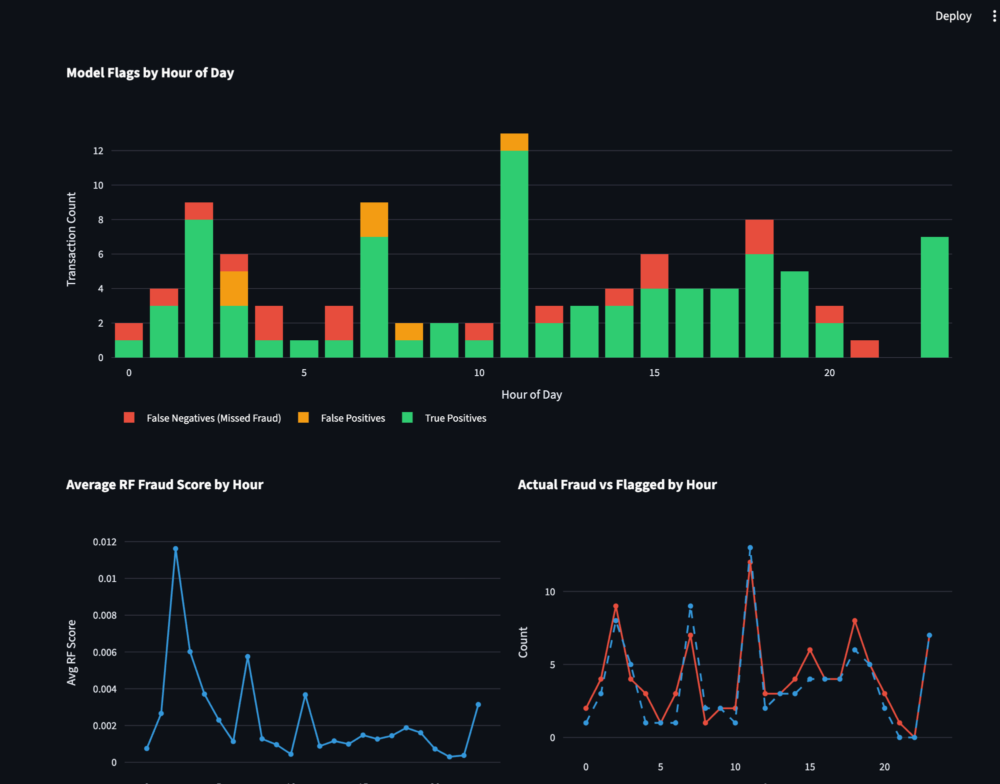

# Fraud Detection Pipeline

End-to-end machine learning pipeline for detecting fraudulent credit card transactions. Built on the [Kaggle Credit Card Fraud Detection dataset](https://www.kaggle.com/datasets/mlg-ulb/creditcardfraud) (284,807 transactions, 492 fraudulent — a 0.17% fraud rate).

Most fraud detection projects stop at model accuracy. This one goes further: it frames output around business decisions — the cost of missing real fraud vs. the cost of false alarms — and includes threshold tuning, a Supabase storage layer, and a live Streamlit dashboard designed for compliance analyst review.

**Live dashboard:** [fraud-detection-pipeline.streamlit.app](https://fraud-detection-pipeline.streamlit.app) *(deploy link — update after Streamlit Cloud setup)*



## Results (Random Forest @ threshold 0.3)

| Metric | Value |
|--------|-------|
| PR-AUC | 0.8632 |
| ROC-AUC | 0.9580 |
| Precision | 93.0% |
| Recall | 81.6% |
| Transactions flagged | 0.15% |

At threshold 0.3, the model catches 80 of 98 fraud cases while flagging only 87 of 56,962 test transactions for analyst review.

## Dataset

Download `creditcard.csv` from [Kaggle](https://www.kaggle.com/datasets/mlg-ulb/creditcardfraud) and place it in `data/raw/`.

- 284,807 transactions over two days
- 492 fraudulent (0.17% of total)
- 28 PCA-anonymized features (V1-V28), plus Amount, Time, and Class

## Tech Stack

| Tool | Purpose |
|------|---------|
| Python 3.11 | Core language |
| Pandas / NumPy | Data manipulation |
| scikit-learn | Model training and evaluation |
| Supabase (PostgreSQL) | Hosted storage for scored transactions |
| Streamlit | Live dashboard and interactive scoring demo |
| Power BI | Alternative dashboard for compliance review |
| Jupyter | Interactive exploration notebooks |

## Project Structure

```
fraud-detection-pipeline/
├── data/
│   ├── raw/                              # Drop creditcard.csv here
│   └── processed/                        # Generated by pipeline scripts
├── notebooks/
│   └── 01_eda.ipynb, 02_feature_engineering.ipynb, 03_model_training.ipynb
├── pipeline/
│   ├── preprocessing/clean.py            # Step 1: scale Amount, save cleaned data
│   ├── features/engineer.py              # Step 2: create time/velocity/amount features
│   └── model/
│       ├── train.py                      # Step 3: train LR and RF classifiers
│       └── evaluate.py                   # Step 4: metrics, thresholds, comparison
├── streamlit_app/
│   ├── Home.py                           # Entry point: KPIs and project summary
│   ├── db.py                             # psycopg2 query helpers (cached)
│   └── pages/
│       ├── 1_Overview.py                 # Hour-of-day charts, score distribution
│       ├── 2_Flag_Review_Queue.py        # Filterable flagged transaction table
│       └── 3_Score_a_Transaction.py      # Live model inference form
├── db/
│   ├── schema.sql                        # PostgreSQL table and view definitions
│   └── load.py                           # Load scored results into Supabase
├── powerbi/
│   └── setup.md                          # Power BI connection and dashboard setup
├── docs/
│   ├── feature-decisions.md              # Why each feature was engineered
│   ├── model-results.md                  # Full results after training
│   └── threshold-analysis.md             # How to pick the right threshold
├── .env.example                          # Environment variable template
└── requirements.txt
```

## How to Run

### 1. Set up the environment

```bash
python3 -m venv venv
source venv/bin/activate
pip install -r requirements.txt
```

### 2. Get the data

Download `creditcard.csv` from [Kaggle](https://www.kaggle.com/datasets/mlg-ulb/creditcardfraud) and place it in `data/raw/`.

### 3. Run the pipeline

```bash
python pipeline/preprocessing/clean.py
python pipeline/features/engineer.py
python pipeline/model/train.py
python pipeline/model/evaluate.py
```

### 4. Configure Supabase

```bash
cp .env.example .env
# Fill in DB_PASSWORD with your Supabase database password
```

Apply the schema to your Supabase project:
```bash
psql "postgresql://postgres:<password>@db.<project>.supabase.co:5432/postgres" -f db/schema.sql
```

Then load the scored test data:
```bash
python db/load.py
```

### 5. Run the Streamlit dashboard

```bash
streamlit run streamlit_app/Home.py
```

### 6. Connect Power BI (optional)

Follow the instructions in `powerbi/setup.md` to connect Power BI Desktop to Supabase.

## Key Design Decisions

- **`class_weight='balanced'` instead of SMOTE**: gives minority class ~580x weight without synthetic data or training set inflation
- **PR-AUC over ROC-AUC**: ROC-AUC is misleading at 0.17% fraud rate; PR-AUC reflects actual minority-class performance
- **Default threshold 0.3** (not 0.5): lower threshold trades precision for recall — catching more fraud at the cost of more analyst review time
- **`time_since_prev` / `rapid_succession` are dataset-global**, not per-card: the dataset has no card IDs, so velocity is approximated across all transactions. This is a known limitation documented in `docs/feature-decisions.md`.

See [docs/model-results.md](docs/model-results.md) for full results and [docs/threshold-analysis.md](docs/threshold-analysis.md) for threshold selection reasoning.
